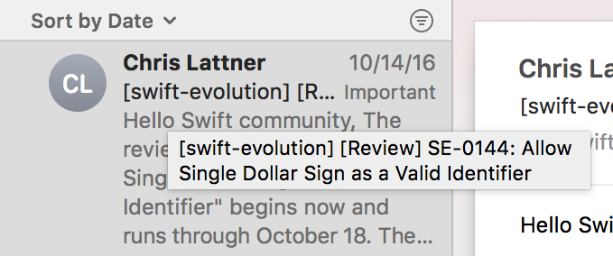

# Details Viewer 

Details Viewer is a simple macOS Mail plugin that shows more details for messages. For example, it can auto-expand the details button in message headers, for when useful information (such as Reply-To, for mailing lists) is hidden in the header. Details Viewer will automatically expand something like this:

	

to this:

	

It also adds tooltips to messages so that you can see their full names and other useful information without opening them:

	

## Installation
Sound useful? You can download the latest release of Details Viewer from [here](https://github.com/saagarjha/DetailsViewer/releases/latest). To install, simply unzip the downloaded file and copy the `DetailsViewer.mailbundle` folder to `~/Library/Mail/Bundles/`. Restart Mail and Details Viewer should be loaded automatically.
